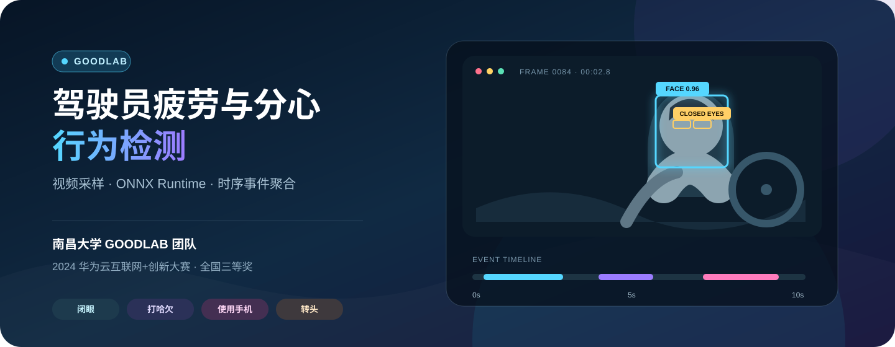
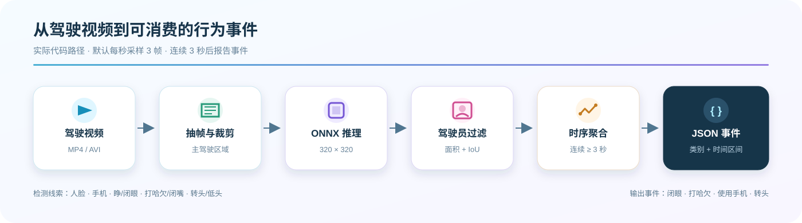

<div align="center">
  
</div>

# GOODLAB 驾驶员疲劳与分心行为检测

南昌大学泛在数据分析与优化实验室（**GOODLAB，Generic Operational and Optimal Data Lab**）团队参加 **2024 华为云互联网+创新大赛**并获**全国三等奖**的参赛项目源码。项目从驾驶视频中提取视觉线索，通过 ONNX Runtime 推理与时序规则，定位闭眼、打哈欠、使用手机和转头等持续行为。

> [!IMPORTANT]
> 这是经过开源整理的赛事原型，不是通过车规认证的安全产品。检测结果不能替代驾驶员监控系统、车辆安全策略或人工判断。

## 项目亮点

| 能力 | 实现 |
| --- | --- |
| 轻量推理 | 保留赛事使用的 320×320 ONNX 模型，可使用 CPU 推理 |
| 主驾驶聚焦 | 裁剪主驾驶区域，并按人脸面积与 IoU 过滤非驾驶员目标 |
| 多行为线索 | 识别人脸、手机、眼睛、嘴部与头部姿态相关类别 |
| 时序去抖 | 默认每秒采样 3 帧，行为连续达到 3 秒才形成事件 |
| 双运行入口 | 提供本地 CLI，并保留 Huawei Cloud ModelArts 适配模板 |
| 可维护结构 | 将原始提交重构为 Python 包，补充类型、测试和公开发布边界 |

## 工作流程

<div align="center">
  
</div>

模型先在主驾驶画面内检测视觉线索，再把单帧结果转换为行为状态，最后聚合为带起止时间的事件：

| 事件类别 | `category` | 主要视觉依据 |
| --- | ---: | --- |
| 闭眼 | `1` | 检测到闭眼类别 |
| 打哈欠 | `2` | 检测到哈欠，且未同时检测到闭嘴 |
| 使用手机 | `3` | 手机目标与驾驶员人脸或胸前区域关联 |
| 转头 / 视线离开 | `4` | 转头、低头或持续未检测到驾驶员人脸 |

## 快速开始

### 1. 环境

- Python 3.9 或更高版本
- macOS、Linux 或 Windows
- CPU 默认可用；CUDA 仅在 ONNX Runtime 提供对应执行器时启用

建议在虚拟环境中安装：

```bash
python -m venv .venv
source .venv/bin/activate
python -m pip install -e .
```

Windows PowerShell 激活命令为：

```powershell
.\.venv\Scripts\Activate.ps1
python -m pip install -e .
```

### 2. 运行视频检测

仓库已经保留赛事 ONNX 权重，默认路径无需额外配置：

```bash
goodlab-fatigue /path/to/driver-video.mp4
```

保存 JSON，并调整采样率或事件持续阈值：

```bash
goodlab-fatigue /path/to/driver-video.mp4 \
  --output outputs/result.json \
  --samples-per-second 3 \
  --min-event-seconds 3
```

启用 CUDA 或输出逐帧检测详情：

```bash
goodlab-fatigue /path/to/driver-video.mp4 --cuda --include-frames
```

### 3. 输出示例

```json
{
  "video": "driver-video.mp4",
  "video_duration_ms": 10000,
  "inference_duration_ms": 2180,
  "sampling": {
    "requested_samples_per_second": 3.0,
    "frame_step": 10,
    "effective_interval_ms": 333
  },
  "events": [
    {
      "category": 1,
      "label": "closed_eyes",
      "period_ms": [1332, 4662]
    }
  ]
}
```

上面的数值只说明数据结构，不代表固定性能或真实测量结果。

## ModelArts 部署

[`deployment/modelarts/`](deployment/modelarts/) 保留了根据原始赛事提交清理的自定义服务适配器和配置模板。目标环境需要提供 `model_service.pytorch_model_service.PTServingBaseService`，并安装本项目包。

ModelArts 镜像、运行时和依赖约束会随平台变化，因此部署前请：

1. 确认目标镜像支持的 Python 和 ONNX Runtime 版本；
2. 将 `models/fatigue-detection-v4-c7-320.onnx` 放入模型目录；
3. 安装本项目包；
4. 使用 `input_video` 表单字段上传视频；
5. 在隔离测试环境验证接口契约、并发与临时文件清理。

此适配模板尚未在当前环境连接真实 ModelArts 服务验证。

## 代码结构

```text
.
├── src/goodlab_fatigue_detection/
│   ├── detector.py          # ONNX 预处理、推理与检测结果转换
│   ├── postprocess.py       # 驾驶员目标筛选与几何工具
│   ├── events.py            # 帧级行为判断与时序事件聚合
│   ├── video.py             # 视频读取与元数据
│   ├── pipeline.py          # 端到端视频分析
│   └── cli.py               # 命令行入口
├── deployment/modelarts/    # 华为云 ModelArts 适配模板
├── models/                  # 一份赛事 ONNX 权重及说明
├── tests/                   # 不依赖视频和模型的单元测试
├── data/README.md           # 本地数据放置与隐私说明
└── docs/readme-assets/      # README 本地视觉资产
```

原始仓库中重复保存了多份 YOLO/Ultralytics 上游源码、模型权重、数据集、IDE 配置、安装程序与压缩包。本次开源整理只保留最终方案需要的原创实现与一份模型文件，第三方框架改为包依赖。

## 模型与数据

- 模型：[`models/fatigue-detection-v4-c7-320.onnx`](models/README.md)
- 输入尺寸：320×320
- 运行后端：ONNX Runtime
- 赛事数据：未包含
- 演示视频：未包含

驾驶视频可能包含人脸、车牌、位置和行程等敏感信息。请只处理已获得授权的数据，不要在 Issue 或 Pull Request 中上传真实私人视频。

模型权重来自团队赛事归档，但训练数据的来源与再分发条款没有随当前仓库完整记录。公开仓库前，权利人仍需确认模型权重及训练数据条款允许再分发。

## 测试

无需加载视频或 ONNX 模型即可运行核心规则测试：

```bash
PYTHONPATH=src python -m unittest discover -s tests -v
```

测试覆盖：

- 坐标格式转换与 IoU；
- 主驾驶人脸、眼睛和手机的空间过滤；
- 单帧行为映射；
- 3 秒事件阈值和短事件丢弃。

完整推理还需要一段有权使用的测试视频。

## 已知限制

- 当前模型和规则来自比赛阶段，未覆盖夜间、逆光、遮挡、多人、摄像头抖动等所有驾驶场景。
- “未检测到人脸”会被视作视线离开线索，低质量画面可能产生误报。
- 行为持续时间受视频帧率、采样间隔和模型召回率影响。
- `--cuda` 只有在安装了兼容的 ONNX Runtime GPU 包及驱动时才会生效。
- 当前没有公开赛事数据，因此仓库不能独立复现实验指标或官方排名。
- ModelArts 目录是适配模板，不是已验证的一键部署产物。

## 贡献

欢迎通过 Issue 报告可复现问题，或提交带测试的改进。请先阅读 [CONTRIBUTING.md](CONTRIBUTING.md)，不要提交凭据、私人视频或无再分发授权的数据。

## 团队与致谢

- 参赛团队：南昌大学泛在数据分析与优化实验室（GOODLAB）
- 英文全称：Generic Operational and Optimal Data Lab
- 团队官网：[GOODLAB 官方网站](https://good.ncu.edu.cn/)
- 赛事：2024 华为云互联网+创新大赛
- 成绩：全国三等奖

项目使用 [ONNX Runtime](https://github.com/microsoft/onnxruntime)、[OpenCV](https://github.com/opencv/opencv) 与 [NumPy](https://github.com/numpy/numpy)。原始实验曾参考 YOLO 系列实现；整理后的仓库不再内置其完整上游源码。

## 许可证

当前仓库**尚未声明开源许可证**。在权利人选择并添加 `LICENSE` 前，代码公开可见不等于获得复制、修改或再分发授权；模型与数据还需要分别确认权利与条款。
